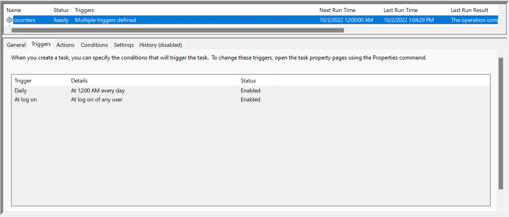

# Status Day Counters

> :mega: This README is mostly for future me if I decide to come back and
> review/enhance this project. If by any chance you are a stray visitor, you're
> welcome to use this code and instructions to mess around with your social
> media accounts too.

## Description: Motivation

Sometimes I want my status to keep track of certain day counts, like "Day X
of..." For example, my GitHub bio used to be set up to say "Day X of waiting for
HSSEAS to let me in" in wait for the results of my application to switch to
Computer Science.

I originally had a few standalone, hard-coded scripts for Discord, Instagram,
and Spotify. This project seeks to just bring them together and one place and
make them configurable and extendable.

<!--
The original standalone scripts are included in the [standalones](standalones)
directory just for record. I am 100% sure they do not work anymore.
-->

## Configuration: Bio Templates

I placed the configuration file at:
```powershell
"$env:USERPROFILE\.config\counters\bios.json"
```
If it's missing, you should make one at this path. A log file is also maintained
in this directory.

As of now, the `bios.json` file should conform to the provided schema,
[`bios.schema.json`](counters/schema/bios.schema.json). This is an example file:

```json
{
  "$schema": "../../repos/counters/counters/schema/bios.schema.json",
  "discord": {
    "status": "day {0} of waiting for HSSEAS to let me in",
    "start": "2022-09-26"
  },
  "instagram": {
    "bio": "Day {0} of waiting for happiness.",
    "start": "2022-09-24"
  },
  "spotify": [
    {
      "comment": "coding grind HSSEAS counter",
      "playlist_id": "5FpuSaX0kDeItlPMIIYBZS",
      "name": null,
      "description": "day {0} of waiting for HSSEAS to let me in",
      "start": "2022-09-26"
    },
    {
      "comment": "love is war season 4 counter",
      "playlist_id": "2X68da6ouUb9pWYK37QMtR",
      "name": null,
      "description": "day {0} of waiting for kaguya season 4",
      "start": "2022-08-16"
    }
  ],
  "github": {
    "bio": "UCLA '24. Day {0} of waiting for HSSEAS to let me in.",
    "start": "2022-09-26"
  }
}
```

Notes:

- The strings to display (`status`, `bio`, `description`) can include, but don't
  need to, a `{0}` placeholder for where the day number will go.
- The `start` keys are dates to be considered as "Day 1" in the count.
- For each Spotify playlist entry, you have the option to change either the
  playlist name, description, or both. Leaving a key as `null` signifies leaving
  it unchanged.
- The `comment` keys are not used nor are they required by the schema. They're
  just a way to document each playlist entry for yourself.

## Usage: Running on Demand

Since this program is meant to automate, it should be hooked up to a
[scheduler](docs/SETUP.md) to be run periodically. That way, the statuses on all
platforms update automatically, and all you need to do when you want to change
the templates is edit the [bios.json file](#configuration-bio-templates).

But for debugging/development purposes, the code can be [run on demand](#demo)
with some command line options:

```sh
poetry run counters [options]
```

This project uses [Poetry](https://python-poetry.org/) for dependency
management. If the above command doesn't work, you probably have not set it up
yet:

```sh
pip install poetry
poetry install
```


### Options Reference

You can also use the `--help` flag for the most up-to-date information directly
at the command line.

| Option           | Description                                                                                                                                                             |
| ---------------- | ----------------------------------------------------------------------------------------------------------------------------------------------------------------------- |
| `-c/--console`   | Only output to the console. Do not write to the log file and do not send an email upon failure.                                                                         |
| `-w/--window`    | Run the Selenium web scraper in an open browser window instead of headlessly.                                                                                           |
| `-d/--discord`   | See below.                                                                                                                                                              |
| `-i/--instagram` | See below.                                                                                                                                                              |
| `-s/--spotify`   | See below.                                                                                                                                                              |
| `-g/--github`    | If any of these 4 switches are included, run these select tasks. Otherwise if all 4 switches are absent from the command line, use the default behavior of running all. |
| `-n/--dry-run`   | Just load the configuration settings and output the values the program *would* run with.                                                                                |

## Demo

Here's a screen recording of this program at work. I included the `--window` and
`--console` flags for demonstration purposes only. The scheduled task runs the
package without any [command line arguments](#usage-running-on-demand), so it
does not spawn a browser window and logs to the log file instead of to a
console.

https://user-images.githubusercontent.com/67369899/193505930-4922aa20-6896-4d39-9531-2f8c2a88b2dd.mp4

The Spotify task uses the [tekore](docs/DEVELOPMENT.md#development-details)
library to directly communicate with the Spotify Web API instead of using
Selenium, so it is not visible in the demo.

And here's a snapshot of the overview of the Task Scheduler task I set up. The
full details can be found [here](docs/SETUP.md).



## Development: Environment Recovery

See [DEVELOPMENT.md](docs/DEVELOPMENT.md#environment-recovery).

## Development: Implementation Details

See [DEVELOPMENT.md](docs/DEVELOPMENT.md#development-details)
